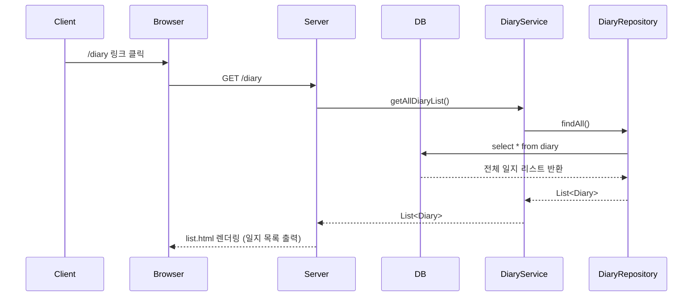

`IndexController`와 `DiaryController`는 둘 다 Spring MVC에서 **컨트롤러 역할**을 하고 있지만, **담당하는 기능과 책임의 범위**가 달라요.  

**✅ 공통점: 둘 다 컨트롤러다**

| 항목 | 설명 |
|------|------|
| 어노테이션 | `@Controller`: 사용자의 요청을 받아서 처리하는 MVC의 컨트롤러 |
| 역할 | 클라이언트 요청 → 처리 → 뷰(View)로 데이터 전달 (`Model`) |
| 반환값 | `return "index"` → `index.html` 또는 `index.jsp` 보여줘 |

---

**✅ `IndexController`**

**🧩 구조**

```java
@Controller
public class IndexController {
    @GetMapping
    public String index(Model model) {
        model.addAttribute("message", "...");
        return "index";
    }
}
```

**💡 역할**

- 홈페이지나 루트 URL(`/`) 접속 시 실행
- 단순히 `"index"` 화면에 메시지를 전달
- 별다른 로직 없이 “메시지 전달 + 뷰 렌더링”만 함

**🎯 왜 있어?**

- 보통 **첫 페이지**, 안내 메시지, 또는 로그인 안내 등을 담당하는 간단한 진입점 역할
- 복잡한 서비스 로직이나 DB 연결이 필요 없음

---

**✅ `DiaryController`**

**🧩 구조**

```java
@Controller
@RequestMapping("/diary")
@RequiredArgsConstructor
public class DiaryController {
    private final DiaryService diaryService;
    private final UploadService uploadService;

    @GetMapping            // /diary
    public String list(...) {...}

    @GetMapping("/new")    // /diary/new
    public String form(...) {...}

    @PostMapping("/new")   // /diary/new (POST)
    public String save(...) {...}
}
```

**💡 역할**

- `/diary`와 관련된 모든 기능을 처리
- **일기 목록 보기**, **새 글 폼 보기**, **글 저장** 까지 담당
- 서비스 계층(`DiaryService`, `UploadService`)과 연결되어 있고, 파일 업로드, DB 저장 등의 로직도 있음

**🎯 왜 있어?**

- **비즈니스 로직이 있는 주요 기능 담당자**
- 게시글을 쓰고 읽는 행위는 단순하지 않기 때문에, 관련된 모든 요청을 묶어서 `/diary` 컨트롤러가 처리
- `SRP` (단일 책임 원칙) 따라 기능 단위로 분리된 구조

---
좋아! 그럼 **1번: 인덱스 페이지 요청 (`GET /`)** 흐름을 상세히 뜯어볼게.  
코드부터 어떤 흐름으로 흘러가는지 단계별로 쪼개서 설명할게!

---
---

**✅ 1. 사용자가 브라우저에서 `/` 접속했을 때**

**🔹 ① 사용자의 요청**

```http
GET /
```

브라우저 주소창에 `http://localhost:8080/` 입력 → `GET /` 요청이 Spring Boot로 전달됨.

---

**🔹 ② IndexController 동작**

```java
@Controller
public class IndexController {

    @GetMapping
    public String index(Model model) {
        model.addAttribute("message", "James 사원, 이따가 회의실로...");
        return "index"; // templates/index.html 을 찾음
    }
}
```

- `@Controller`: 이 클래스가 요청을 처리하는 Spring MVC 컨트롤러라는 뜻.
- `@GetMapping`: 경로가 비어 있음 → `/` 경로에 매핑됨.
- `Model`: 템플릿 엔진(Thymeleaf)에 값을 넘겨주기 위한 객체.
- `model.addAttribute(...)`: 템플릿에 `message`라는 이름으로 텍스트를 넘김.

---

**🔹 ③ 뷰 템플릿 렌더링**

```html
<!-- templates/index.html -->
<p th:text="${message}"></p>
<a th:href="@{/diary}">일지</a>
```

- `${message}` → 컨트롤러에서 넘긴 `"James 사원, 이따가 회의실로..."`가 표시됨.
- `@{/diary}` → 일지 목록 페이지로 이동할 수 있는 링크.

---

**🔹 ④ 브라우저에 최종적으로 보여지는 HTML**

```html
<p>James 사원, 이따가 회의실로...</p>
<a href="/diary">일지</a>
```

---

**🔁 전체 흐름 요약 (End-to-End)**

```
Client (브라우저)
   |
   |  GET /
   ▼
Spring Boot (IndexController)
   |
   |  message 모델에 담고
   ▼
Thymeleaf (templates/index.html)
   |
   |  HTML 렌더링
   ▼
Client (브라우저)
```

---

**💡 이 코드의 역할은?**

| 구성 요소             | 역할 설명 |
|----------------------|-----------|
| `@GetMapping`         | `/` 요청을 받아 |
| `Model`               | 화면에 보여줄 메시지 담고 |
| `return "index"`      | `index.html` 템플릿을 리턴 |
| `th:text`             | 전달받은 데이터를 HTML에 출력 |

---
---
**✅ 2. `/diary` 경로 요청 → 일지 목록 출력 흐름**

---

**🔁 전체 흐름 (End-to-End)**

**① 사용자가 `/diary`로 이동**

→ 예: 브라우저에서 `/diary` 주소를 직접 입력하거나, `/`에 있는 "일지" 링크를 클릭

**② 서버로 GET 요청 전송**

```http
GET /diary HTTP/1.1
```

**③ `DiaryController`가 요청을 처리**

```java
@GetMapping
public String list(Model model) {
    model.addAttribute("message", "리스트임다");
    model.addAttribute("list", diaryService.getAllDiaryList());
    return "diary/list";
}
```

- `message`에 `"리스트임다"`라는 문자열을 담고
- `list`에는 `diaryService.getAllDiaryList()` 결과 (DB에 저장된 일지 목록)를 담음

**④ `DiaryService` → `DiaryRepository` → DB 조회**

```java
public List<Diary> getAllDiaryList() {
    return diaryRepository.findAll();
}
```

- JPA가 자동으로 SQL을 날려 DB에서 모든 `Diary` 레코드를 조회함  
→ `select * from diary`

**⑤ 조회된 일지 리스트가 Thymeleaf 뷰로 전달됨**

뷰 템플릿: `src/main/resources/templates/diary/list.html`

```html
<ol>
    <li th:each="diary : ${list}">
        <p th:text="${diary}"></p>
    </li>
</ol>
```

- 전달된 `list`를 반복하면서 `<li>` 안에 하나씩 보여줌

**⑥ 최종적으로 브라우저에 아래와 같이 렌더링됨 (예시)**

```html
<p>리스트임다</p>

<ol>
  <li>
    Diary(uuid=..., title=오늘의 일기, content=힘들었어요, imageUrl=..., createdAt=...)
  </li>
  <li>
    Diary(uuid=..., title=개발일지, content=SpringBoot 처음 써봄, imageUrl=..., createdAt=...)
  </li>
</ol>
```

(Thymeleaf 기본 toString() 출력이라, 엔티티 필드들이 한 줄로 나옴)

---

**🧭 시퀀스 다이어그램**



